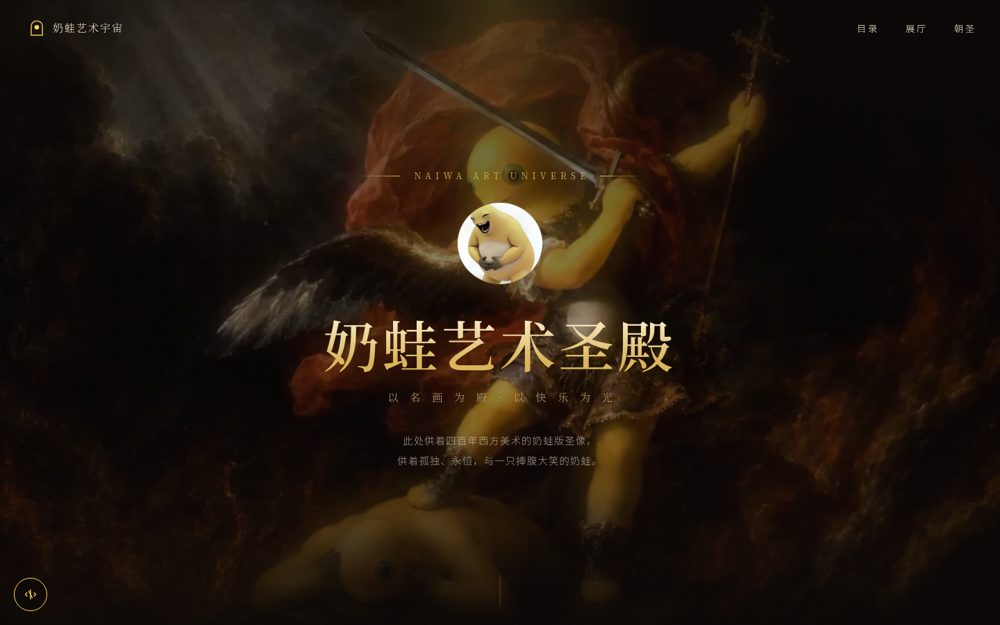
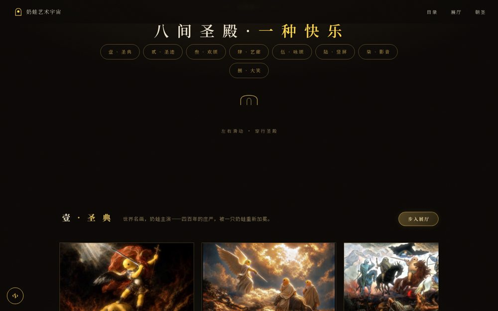
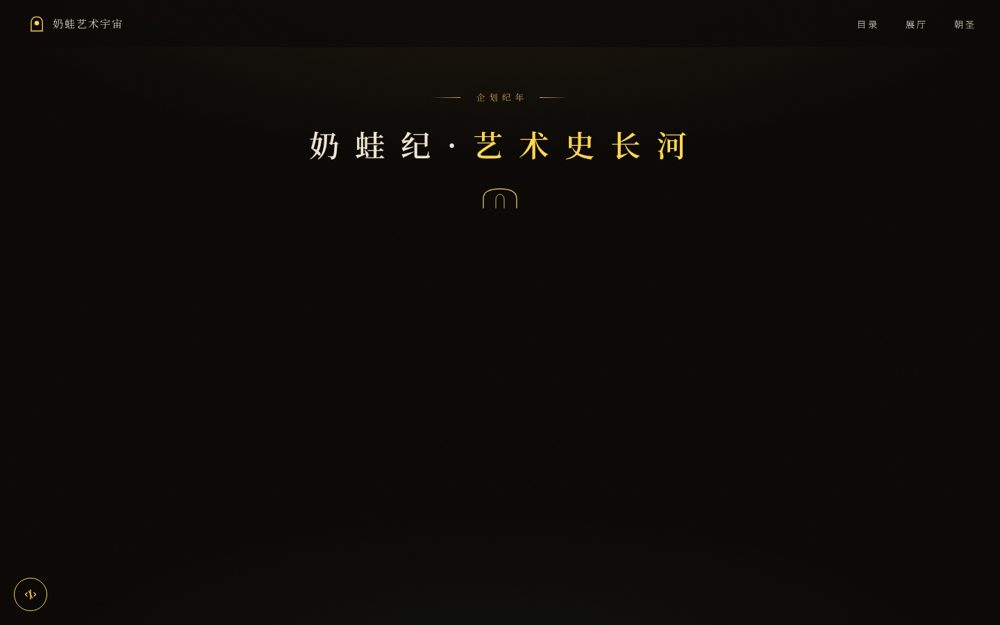
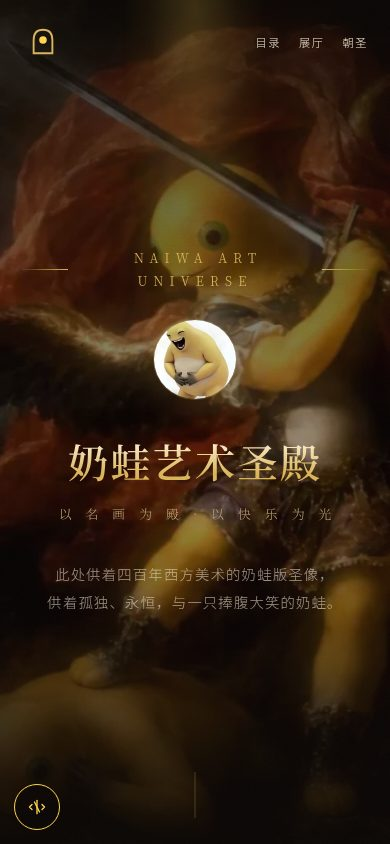
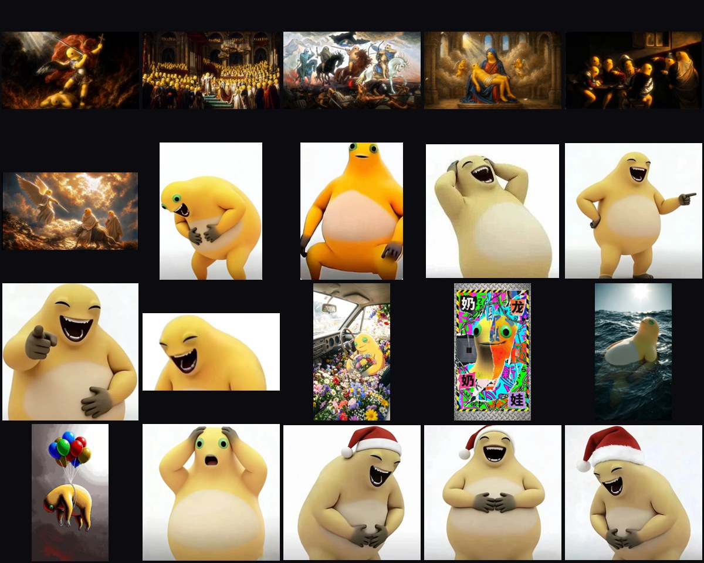

# NAIWA ART UNIVERSE · 奶蛙艺术圣殿

**以名画为躯 · 以快乐为光**
> 一座供养着四百年西方美术"奶蛙版"圣像的线上艺术殿堂 —— 185 件馆藏、8 大展厅、3 卷圣影，点击即可入殿朝圣。

**喜欢就点个 ⭐ —— 每一颗星，都是圣殿门前的一盏灯。**

---

## 一、入殿（在线参观）

| 入口 | 链接 | 说明 |
| --- | --- | --- |
| 官网主入口 | [nailong-studio.github.io/NaiLong-Universe](https://nailong-studio.github.io/NaiLong-Universe/) | GitHub Pages 直连，全球可达 |
| 豆包镜像 | [4m2km3hh7ey1t.doubaoapps.com](https://4m2km3hh7ey1t.doubaoapps.com/app/app_17en7jm93zm/) | 国内访问更顺滑 |

**桌面端全景（首页 → 展厅 → 艺术史长河）**

  
  

  
  

---

## 二、这是什么

**奶蛙**，是官方奶龙角色的**民间 AI 变异体**：黄圆润的身体、浅米色的肚腹、碧绿的眼睛、灰扑扑的小爪。官方拉黑之争、B 站考古与抽象新神的传说，构成了它独特的「受难与重生」叙事。

本项目把奶蛙放进**西方美术史的圣殿**：维纳斯变成奶蛙、大天使长审判变成奶蛙、星月夜、呐喊、拾穗者…… 四百年的名画，被一只捧腹大笑的奶蛙重新演绎。你不是在看画——你是在**巡游一座会笑的艺术馆**。

---

## 三、八大展厅（馆藏目录）

| 厅 | 名称 | 藏品 |
| --- | --- | --- |
| 壹 | 经典名画厅 | 38 件 名画再创作 · 奶蛙版圣像 |
| 贰 | 艺术珍藏厅 | 30 件 星空、异想与艺术的奶蛙宇宙 |
| 叁 | 生活百态厅 | 21 件 奶蛙的人间烟火 |
| 肆 | 艺术史珍藏厅 | 21 件 从创世纪到抽象主义的巡礼 |
| 伍 | 表情圣殿厅 | 19 件 斗图圣器 · 会动的那种 |
| 陆 | 特藏私享厅 | 21 件 孤品与限定 |
| 柒 | 影音殿堂厅 | 3 卷 官方圣影（Ken Burns 巡展） |
| 捌 | 大笑藏馆 | 30 件 全网收集 · 大笑奶蛙变体 |

**185 件馆藏，每件都有专属叙事**——点开任意作品，灯箱会为你讲述这幅「画」的故事；作品名、展厅、原作对照，一应俱全。

**素材墙一览（部分馆藏）**

  

---

## 四、圣殿体验（为什么值得逛）

- **沉浸式参观**：画廊双开金门 → 八大展厅横向巡游 → 沉浸展厅全屏观影，四层递进的观展动线
- **每件作品都会讲故事**：灯箱叙事、Ken Burns 缓推慢摇的圣影巡展
- **艺术史长河**：从创世纪到现代主义，奶蛙版的西方美术编年史，纵向沉浸滚动
- **背景音乐**：入殿即闻圣咏（`temple-choir`），可随时静音
- **零依赖**：单个 HTML 文件自包含全部 CSS/JS，无构建、无框架、离线可用

---

## 五、技术亮点（极客向）

| 能力 | 实现 |
| --- | --- |
| 单文件自包含 | 全部样式/脚本内联，一个 `.html` 到手即用 |
| hash 路由多视图 | `#home` / `#halls` / `#chronicle` / `#visit` 四视图 |
| 纯 CSS 3D 画廊之门 | 三层视差画作 + 双开金门 + 门缝圣光，无 WebGL |
| 性能优先 | 全站 216 图 eager + 灯箱/展厅预载，翻页秒开 |
| 资源治理 | 48MB → 37MB（WEBP 压缩 / 原始 gif 溯源恢复） |
| 自动部署 | GitHub Actions：push main → Pages 自动上线 |

---

## 六、素材仓库

全部馆藏原图托管于 [Nailong-Studio/wallpaper](https://github.com/Nailong-Studio/wallpaper)：

| 目录 | 内容 |
| --- | --- |
| `classic/` | 38 件 名画再创作 |
| `laugh-gallery/` | 30 件 大笑藏馆 |
| `emotes/` | 33 件 表情包 |
| `art/` | 36 件 艺术场景 |
| `hd/` | 22 件 高清壁纸 |
| `frames/` | 38 件 视频帧图 |
| `videos/` | 3 卷 官方圣影 |

**命名规范**：全仓中文语义命名（`奶蛙-弯腰大笑.png`），每件素材配套同名 `.txt` 叙事。想提交新素材？看 [wallpaper/CONTRIBUTING.md](https://github.com/Nailong-Studio/wallpaper/blob/main/CONTRIBUTING.md)。

---

## 七、一起建殿（贡献）

- **提交素材**：奶蛙表情 / 名画再创作 / 场景脑洞 → wallpaper 仓（规范见上）
- **修官网**：改 `docs/index.html` 后提交 PR，Actions 自动上线
- **写叙事**：给馆藏配更好的故事，提交同名 txt
- **提建议**：开 [Issue](https://github.com/Nailong-Studio/NaiLong-Universe/issues/new) 告诉我们

> 参与即默认遵守 [行为准则](CODE_OF_CONDUCT.md) 与 [贡献指南](CONTRIBUTING.md)。

---

## 八、Roadmap

- [x] 八厅 185 件馆藏 + 逐件叙事
- [x] 艺术史长河 · 沉浸纪年页
- [x] 三卷 Ken Burns 圣影
- [x] 素材仓统一奶蛙命名 + 叙事 txt
- [ ] 更多名画系列（东方美术史 / 现代艺术）
- [ ] 馆藏搜索与筛选
- [ ] 圣殿多语言（EN / 日）
- [ ] 投稿审核工作流（PR 自动查重）

---

**NAIWA ART UNIVERSE** · 圣殿长明，欢迎常来

如果这个项目让你笑了，[点个 Star](https://github.com/Nailong-Studio/NaiLong-Universe/stargazers) 就是给圣殿添了一盏灯。

