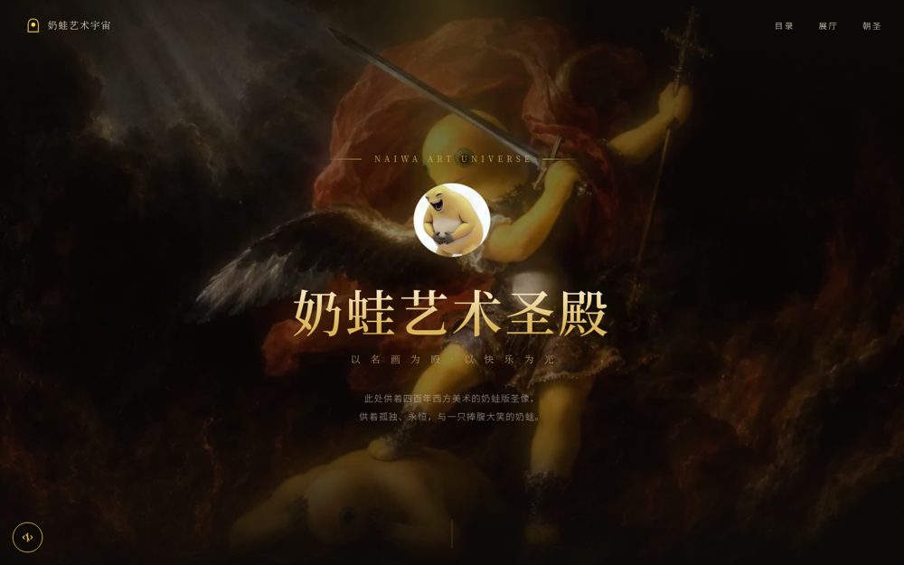
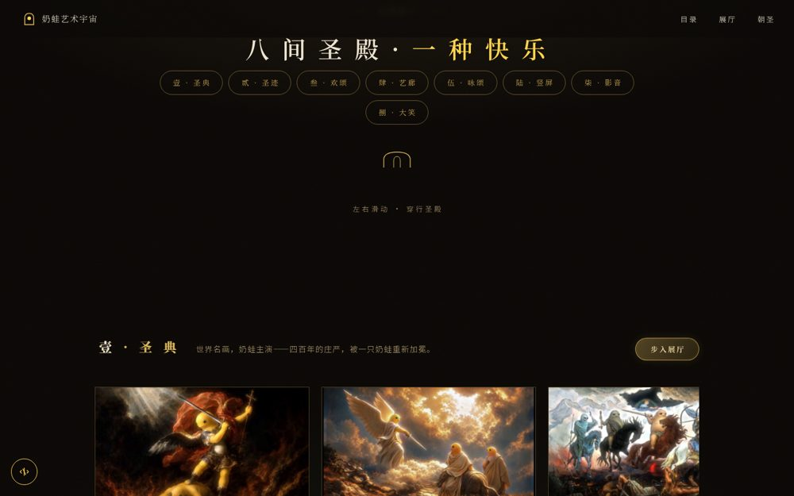
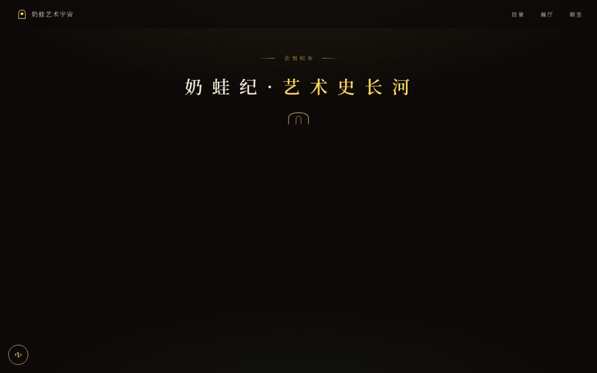
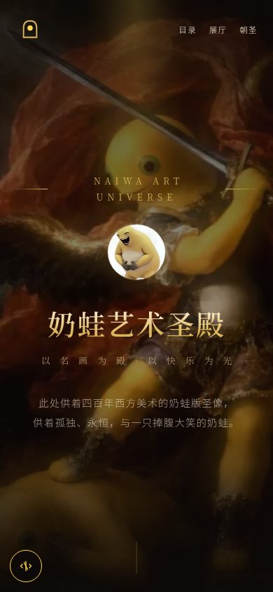
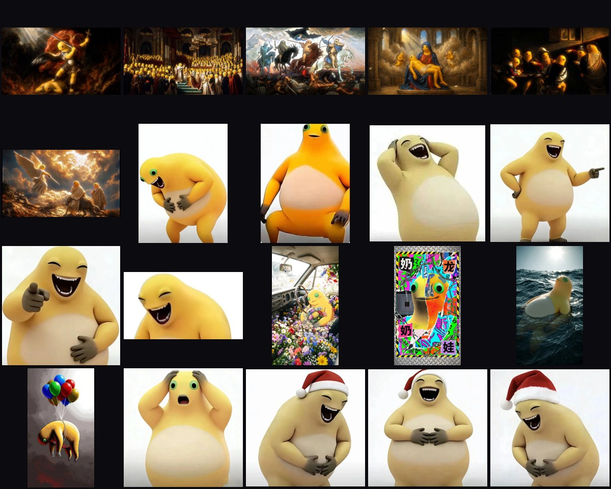

# NAIWA ART UNIVERSE · 奶蛙艺术圣殿

**以名画为躯 · 以快乐为光**
> 一座供养着四百年西方美术"奶蛙版"圣像的线上艺术殿堂 —— 186 件馆藏、8 大展厅、3 卷圣影，点击即可入殿朝圣。

> **香油钱箱（aka Star 按钮）**：圣殿不收门票，只收星星。点一下右上角的 ⭐，就是往功德箱里投了一盏灯——奶蛙会保佑你的表情包永远不缺。

---

## 一、入殿（在线参观）

| 入口 | 链接 | 说明 |
| --- | --- | --- |
| 官网主入口 | [nailong-studio.github.io/NaiLong-Universe](https://nailong-studio.github.io/NaiLong-Universe/) | GitHub Pages 直连，点开即入殿 |
| 常用入口 | 展厅 `#halls` · 单厅 `#hall-1`…`#hall-8` · 检索 `#search` · 游客中心 `#about` | 均可直接分享 |
| 素材仓库 | [Nailong-Studio/wallpaper](https://github.com/Nailong-Studio/wallpaper) | 全部馆藏原图与圣影 |

**桌面端全景（首页 → 展厅 → 艺术史长河）**

  
  

  
  

---

## 二、这是什么

**奶蛙**，是官方奶龙角色的**民间 AI 变异体**：黄圆润的身体、浅米色的肚腹、碧绿的眼睛、灰扑扑的小爪。官方拉黑之争、B 站考古与抽象新神的传说，构成了它独特的「受难与重生」叙事。

本项目把奶蛙放进**西方美术史的圣殿**：维纳斯变成奶蛙、大天使长审判变成奶蛙、星月夜、呐喊、拾穗者…… 四百年的名画，被一只捧腹大笑的奶蛙重新演绎。你不是在看画——你是在**巡游一座会笑的艺术馆**。

---

## 三、八大展厅（馆藏目录）

| 厅 | 名称 | 藏品 |
| --- | --- | --- |
| 壹 · 圣典 | 38 件 | 世界名画，奶蛙主演——四百年的庄严，被一只奶蛙重新加冕 |
| 贰 · 圣迹 | 9 件 | 外传圣迹——奶蛙的永恒，与孤独奶蛙主义的八幕启示 |
| 叁 · 欢颂 | 22 件 | 人间篇章——原图直出的大笑圣像，一笑解千愁 |
| 肆 · 艺廊 | 36 件 | 粉丝二创——奶蛙走进深海、旷野与霓虹 |
| 伍 · 咏颂 | 22 件 | 圣咏表情——聊天框里供奉一只奶蛙，动图圣物快乐加倍 |
| 陆 · 竖屏 | 26 件 | 竖屏圣物——把名画裁成竖屏，陪你刷过每个日夜 |
| 柒 · 影音 | 3 卷 | 官方圣影——把奶蛙的快乐卷进胶片（Ken Burns 巡展） |
| 捌 · 大笑藏馆 | 30 件 | 全网搜集的奶蛙变体同人 + 表情，三十件笑面收进一馆 |

**186 件馆藏，每件都有专属叙事**——点开任意作品，灯箱会为你讲述这幅「画」的故事；作品名、展厅、原作对照，一应俱全。

**素材墙一览（部分馆藏）**

  

---

## 四、圣殿体验（为什么值得逛）

- **沉浸式参观**：画廊双开金门 → 八大展厅横向巡游 → 单厅前言墙 → 沉浸放映厅全屏观影，逐层递进的观展动线
- **每件作品都有说明牌**：馆藏编号 `NW-<厅>-<序号>`、形制、原作对照、专属叙事，桌面左图右牌、移动上下堆叠
- **可分享的每一层**：单厅 `#hall-3`、单件作品 `#w-1-001` 都能直接转发定位
- **馆藏检索**：关键词（标题 / 叙事 / 展厅）+ 八厅筛选，命中即直达说明牌
- **艺术史长河**：从创世纪到现代主义，奶蛙版的西方美术编年史，纵向沉浸滚动
- **放映厅**：Ken Burns 巡展带进度条与播放·暂停，可停下细看某一件
- **游客中心**：参观须知、版权与二创声明、投稿路径、无障碍说明、殿史纪年
- **背景音乐**：入殿即闻圣咏（`temple-choir`），可随时静音
- **零依赖**：单个 HTML 文件自包含全部 CSS/JS，无构建、无框架、离线可用

---

## 五、技术亮点（极客向）

| 能力 | 实现 |
| --- | --- |
| 单文件自包含 | 全部样式/脚本内联，一个 `.html` 到手即用 |
| hash 路由多视图 | `#home` / `#halls` / `#hall-N` / `#w-<编号>` / `#chronicle` / `#visit` / `#search` / `#about` |
| 纯 CSS 3D 画廊之门 | 三层视差画作 + 双开金门 + 门缝圣光，无 WebGL |
| 性能优先 | 全站 lazy 懒加载 + 28px LQIP 模糊占位淡入 + 解码完成淡入 + 邻近预载；`content-visibility` 降低长列表渲染成本 |
| 多端适配 | ≤640px 沉浸卡片宽度 / ≥1680px 版心放宽 / 异形屏安全区 / 吸顶厅导航 |
| 无障碍与降级 | 键盘全可达、`prefers-reduced-motion` 全部动效降级、alt 与标题一致、图片加载失败兜底 |
| 数据可校验 | `scripts/export_collection.py` 导出 `docs/data/collection.json` 并校验件数 / 命名 / 叙事 / 原作外链 |
| 现代视觉层 | View Transitions 视图过渡 · 极光底幕 · 玻璃导航 · 阅读进度条 · 回到顶部 · 流光标题 · `:has()` 状态样式（全部渐进增强，`prefers-reduced-motion` 整体降级） |
| 资源治理 | 48MB → 37MB（WEBP 压缩 / 原始 gif 溯源恢复） |
| 自动部署 | GitHub Actions：push main → Pages 自动上线 |

> 目录小抄：`docs/index.html` 官网源文件 · `docs/data/collection.json` 藏品索引 · `scripts/` 构建与校验脚本 · `palette.json` 主题调色板单源 · `themes/` 各平台主题 · `resources/ports.yml` 主题移植登记 · `site/` 旧版 Astro 画廊（仅存档） · `PLAN.md` 改造规划

---

## 五点五、圣殿游客须知（认真脸）

- 圣殿只供快乐，不做商业用途；奶龙形象版权归官方所有，奶蛙是民间二创，别拿去卖钱（会遭天谴，字面意义）。
- 馆藏会不定期增加，欢迎反复回访；出门左转是 [朝圣之路](https://nailong-studio.github.io/NaiLong-Universe/#visit)，可免费领取壁纸、表情、主题。
- 所有素材均为同好用爱发电，若你发现某件藏品侵权，请开 Issue 通知我们下架，功德无量。
- 看不懂代码没关系，圣殿的门从不为难游客；想看懂的话，`docs/index.html` 只有一页，从头读到尾约等于读完一本《圣殿施工手册》。

---

## 六、素材仓库

全部馆藏原图托管于 [Nailong-Studio/wallpaper](https://github.com/Nailong-Studio/wallpaper)：

| 目录 | 内容 |
| --- | --- |
| `classic/` | 38 件 名画再创作 |
| `laugh-gallery/` | 19 件 大笑藏馆 |
| `emotes/` | 32 件 表情包 |
| `art/` | 36 件 艺术场景 |
| `hd/` | 22 件 高清壁纸 |
| `frames/` | 38 件 视频帧图 |
| `videos/` | 3 卷 官方圣影 |

**命名规范**：全仓中文语义命名（`奶蛙-弯腰大笑.png`），每件素材配套同名 `.txt` 叙事。想提交新素材？看 [wallpaper/CONTRIBUTING.md](https://github.com/Nailong-Studio/wallpaper/blob/main/CONTRIBUTING.md)。

---

## 七、一起建殿（贡献）——圣殿是大家的

你不需要会写代码也能入殿。三条路，总有一条适合你：

| 你想做的事 | 怎么开始 | 需要什么 |
| --- | --- | --- |
| 交一件素材（最容易） | 到 [wallpaper 仓](https://github.com/Nailong-Studio/wallpaper) 提 PR | 一张奶蛙图 + 一句话叙事，命名按规范 |
| 改官网 bug | 改 `docs/index.html` 提 PR | 会一点 HTML/CSS/JS 就行 |
| 写圣像的叙事 | 给素材配同名 `.txt` | 会讲笑话/会起名/会考古 |
| 出个新主题 | 基于 `palette.json` 派生 | 会配色 |
| 只会点赞 | 点 ⭐ + 分享给朋友 | 不需要任何技能 |

> 具体规则见 [贡献指南](CONTRIBUTING.md)（读一遍只要 3 分钟，功德 +1）。
> 提交前记得去素材仓搜一搜，别让圣殿出现两件一模一样的「奶蛙-弯腰大笑」。

---
## 八、Roadmap

> 完整改造规划（信息架构 / 页面场景 / 视觉系统 / 数据模型 / 分阶段路线）见 [PLAN.md](PLAN.md)。

- [x] 八厅 186 件馆藏 + 逐件叙事 + 说明牌（编号 NW-x-xxx / 形制 / 原作对照）
- [x] 艺术史长河 · 沉浸纪年页
- [x] 三卷 Ken Burns 圣影
- [x] 素材仓统一奶蛙命名 + 叙事 txt
- [ ] 更多名画系列（东方美术史 / 现代艺术）
- [x] 馆藏检索与展厅筛选（#search：关键词 + 八厅筛选，结果直达作品说明牌）
- [ ] 圣殿多语言（EN / 日）
- [ ] 投稿审核工作流（PR 自动查重）

---

**NAIWA ART UNIVERSE** · 圣殿长明，欢迎常来

如果这个项目让你笑了，[点个 Star](https://github.com/Nailong-Studio/NaiLong-Universe/stargazers) 给圣殿添灯；
要是它让你笑出声了，[提交一件素材](https://github.com/Nailong-Studio/wallpaper/blob/main/CONTRIBUTING.md) 直接当圣殿股东。
再不行，把它分享给一个笑点低的朋友——也算积德。

